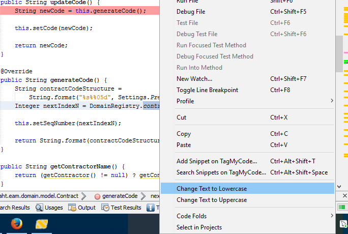

# nbm-changecase-plugin

Add change text to Uppercase/Lowercase to editor popup menu.

Steps:

1. Select the text you want make UPPER/LOWER case.
2. Right click to show editor contextual menu.
3. Click "Change Text to Uppercase" or "Change Text to Lowercase" and done.

Result:

